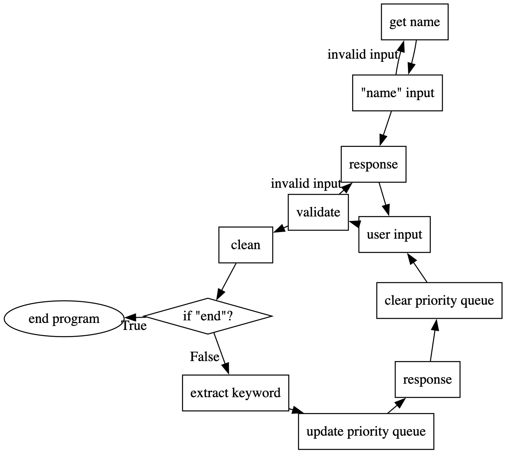

# ELIZA

Eliza was a program created by Joseph Weizenbaum in 1966 that took natural language inputs from users and transformed them into natural language responses, making it one of the first chatbots. This program is my recreation of that original concept in python for my natural language processing class. 

## How it Works

This program takes a user's input and compares the words in it to find keywords that could map to possible responses. Each keyword has a rank associated with it and the keywords found are put into a priority queue based on the rank and position of the keyword. Lower ranks have higher priority. Each keyword has a list of (pattern, transformation) pairs associated with them. When a keyword is chosen, each pattern is tested for a match in-order until one is found. Then, the associated transformation rule is applied to the input to create the response using parts of the input.



## Instructions

To run this program, you must have python installed on your device, then run this command:

`python eliza.py`

# Reference
```bibtex
@article{weizenbaum1966eliza,
  title={ELIZA—a computer program for the study of natural language communication between man and machine},
  author={Weizenbaum, Joseph},
  journal={Communications of the ACM},
  volume={9},
  number={1},
  pages={36--45},
  year={1966},
  publisher={ACM New York, NY, USA}
}
```